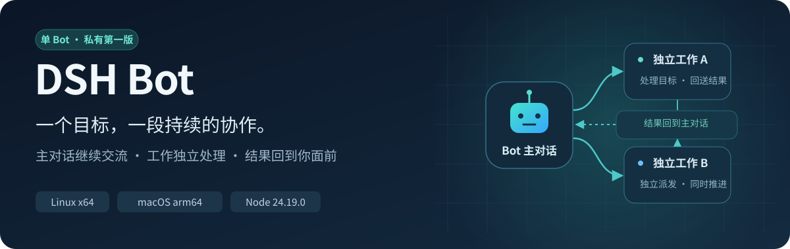
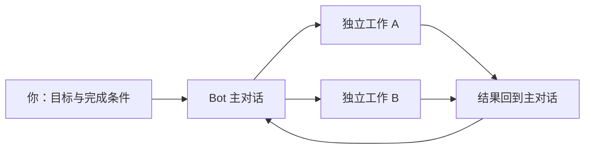

<p align="center">
  
</p>

<h1 align="center">DSH Bot · 单 Bot 私有第一版</h1>

<p align="center">在主对话交代目标，让 Bot 创建工作对话、处理任务，再把结果带回主对话。</p>

<p align="center">
  <a href="https://github.com/86cloudyun-afk/dsh-bot/releases/tag/v0.1.0-private.1">下载这一版</a> ·
  <a href="docs/installation.zh-CN.md">中文安装指南</a> ·
  <a href="docs/releases/private-v1.zh-CN.md">版本与验收</a> ·
  <a href="docs/faq.zh-CN.md">常见问题</a>
</p>

> **当前交付：私有预发布 `v0.1.0-private.1`。** 支持 Linux x64 和 macOS arm64，使用恰好 Node **24.19.0**。产品包元数据保持 `0.1.0-alpha.1`。公开分发状态仍为 **NOT_CLEARED**；此仓库和下载页保留私有权限。

## 这一版能做什么

| 功能 | 使用方式与本次验证范围 |
| --- | --- |
| 主对话与工作对话 | 在主对话提交目标，Bot 自主建立独立工作对话；Linux 真实模型链路已验证 |
| 长任务期间派发短任务 | 长工作仍在运行时，主对话接受另一个目标，创建短工作，两个结果均回到主对话；Linux 实测 |
| 查看结果与接续 | 查看原工作结果，确认结束后接续同一工作；Linux 实测 |
| 归档与恢复 | 恢复同一 Bot、主对话和工作身份；Linux 实测 |
| 停止与冷启动 | 停止原工作；结算不完整时保留 UNKNOWN 和槽位，同 Home 冷启动不重放；Linux 实测 |
| 一级子工作与 15 个工作槽 | 父工作、子工作和 UNKNOWN 共用上限；原生 SDK 与 GUI 受控验证，未做 15 个真实模型并发压测 |

本版聚焦**单 Bot**。多 Bot、内部群聊和会议协作属于后续范围。



## 下载与安装

### 1. 获取完整交付包

打开 [这一版的 GitHub 下载页](https://github.com/86cloudyun-afk/dsh-bot/releases/tag/v0.1.0-private.1)，在 **Assets** 下载：

- **`dsh-bot-v1-private-delivery-20261008-r2.tar.gz`**：15,558,289 字节，含安装薄包、中文指南、交付说明、验收清单和内部校验文件。
- **`dsh-bot-v1-private-delivery-20261008-r2.tar.gz.sha256`**：完整交付包的 SHA-256 校验文件。

需要先阅读时，下载页也提供独立的中文指南、最终审计和验收清单。**GitHub 自动生成的 “Source code” 文件只含仓库源码；安装使用上面的完整交付包。**

### 2. 核对并解压

在刚下载的两个文件所在目录打开终端，先核对完整交付包：

Linux x64：

```sh
sha256sum --check dsh-bot-v1-private-delivery-20261008-r2.tar.gz.sha256
```

macOS arm64：

```sh
shasum -a 256 --check dsh-bot-v1-private-delivery-20261008-r2.tar.gz.sha256
```

收到 `OK` 后，在同一终端执行以下命令。解压目录必须尚不存在：

```sh
(
  set -eu
  umask 077
  test ! -e dsh-bot-v1-private-delivery-20261008-r2
  test ! -L dsh-bot-v1-private-delivery-20261008-r2
  tar -xzpf dsh-bot-v1-private-delivery-20261008-r2.tar.gz
)
```

打开解压目录中的 **`CURRENT_INSTALLATION_GUIDE.zh-CN.md`**，按实际操作系统核对内部 `SHA256SUMS` 和薄包，再完成安装、启动与正常浏览器认证。仓库中有[同一份中文指南](docs/installation.zh-CN.md)，[下载说明](docs/github-download.zh-CN.md)给出完整包与薄包的对应关系。

### 3. 启动界面并提交目标

安装成功后，使用 `installation-manifest.json` 中的 **`manualStartup`** 启动 `dsh-bot-gui`，打开进程打印的本地浏览器地址，创建 Bot，再在主对话提交目标与完成条件。

默认启动可查看界面和历史，**模型请求默认关闭**。实际执行模型任务时，通过进程环境提供 `DEEPSEEK_API_KEY`，并显式添加 `--enable-model-requests`。具体命令见[安装指南](docs/installation.zh-CN.md)；密钥只保留在自己的运行环境中。

## 运行要求

| 项目 | 当前要求 |
| --- | --- |
| 操作系统 | Linux x64 / macOS arm64 |
| Node | 恰好 `24.19.0` |
| 安装网络 | 可访问公共 npm registry；严格 TLS，按固定 lock 安装官方 SDK |
| 安装目录 | 本人可写、规范绝对路径；输出目录必须全新 |
| 运行身份 | 使用同一安装目录、Home 和 `dsh-bot-gui` profile；每个 Home 由一个 CLI 进程写入 |
| 工作数量 | 每 Bot 共用 15 槽，包含父工作、一级子工作和 UNKNOWN |
| 结果回送 | 最多 4096 UTF-8 字节，建议每个任务控制在 3400 字节以内 |

Windows、macOS Intel 及其他 Node 版本尚不在本次支持范围。

## 已验证到哪里

| 验收 | 结果与边界 | 证据入口 |
| --- | --- | --- |
| 最终源码 native / JS / runtime-export | Linux、macOS 六组通过，绑定源码 `1f111d7` | [CI 37709629136](https://github.com/86cloudyun-afk/dsh-bot/actions/runs/37709629136) |
| 同一薄包全新安装与真实 GUI | Linux、macOS 均通过；此轮模型请求为零 | [CI 37712266847](https://github.com/86cloudyun-afk/dsh-bot/actions/runs/37712266847) |
| Host M3 可复现构建 | 两平台通过；来源与通知保留，修改权利仍待确认 | [CI 37686757086](https://github.com/86cloudyun-afk/dsh-bot/actions/runs/37686757086) |
| Linux 真实模型闭环 | 11 个请求：10 个完整结束，1 个停止后最终结算 UNKNOWN；旧 UNKNOWN 未重放 | 下载页的 `QUALIFICATION.json` |
| 私有交付独立审计 | 限定技术范围 C=0 / I=0 / M=0；公开分发尚未放行 | 下载页的最终审计 JSON |

macOS 本轮完成 native 和无模型 GUI 验证，真实模型闭环实测属于 Linux。原始记录中的 `fullTaskQualification: false` 保留；这些证据对应[明确的验收范围](docs/releases/private-v1.zh-CN.md)。

## 使用时记住这三点

1. **UNKNOWN 查询原回执。** 保留原身份与原操作，继续占用工作槽；不自动重试或重放。
2. **结束与收到结果分别核对。** 原工作结束已知，结果仍可能因过大而没有送回主对话；先查看原工作回复，再拆成较小任务。
3. **重启保留同一 Home。** 原 CLI 和原进程组停止后，再启动新进程；归档与恢复继续使用同一 Bot 和会话身份。

## 中文文档

| 文档 | 内容 |
| --- | --- |
| [安装与使用](docs/installation.zh-CN.md) | 校验、安装、启动、启用模型、提交、接续、停止与恢复 |
| [GitHub 下载说明](docs/github-download.zh-CN.md) | 登录、选择正确资产、解压完整交付包、交给另一个工具读取 |
| [第一版发布说明](docs/releases/private-v1.zh-CN.md) | 固定版本、已验证功能、证据边界和分发状态 |
| [常见问题](docs/faq.zh-CN.md) | 下载权限、平台、密钥、结果大小、UNKNOWN 与安装失败 |
| [开发与源码说明](docs/development.zh-CN.md) | 冻结源码、文档分支、历史资料和本地检查入口 |

## 许可与分发状态

本次用于本人私有安装和自用。Bot 与私有 Host 修改的公开分发权利，以及 `node-addon-system@0.1.2` 的 BSD 元数据与 MIT 入口 LICENSE 的适用范围，仍需事实确认。完整依赖通知随安装材料保留；技术验收通过不改变这些授权状态。

私有 GitHub 预发布提供固定字节的下载入口。正式公开 v1 仍为 **NOT_CLEARED**。
