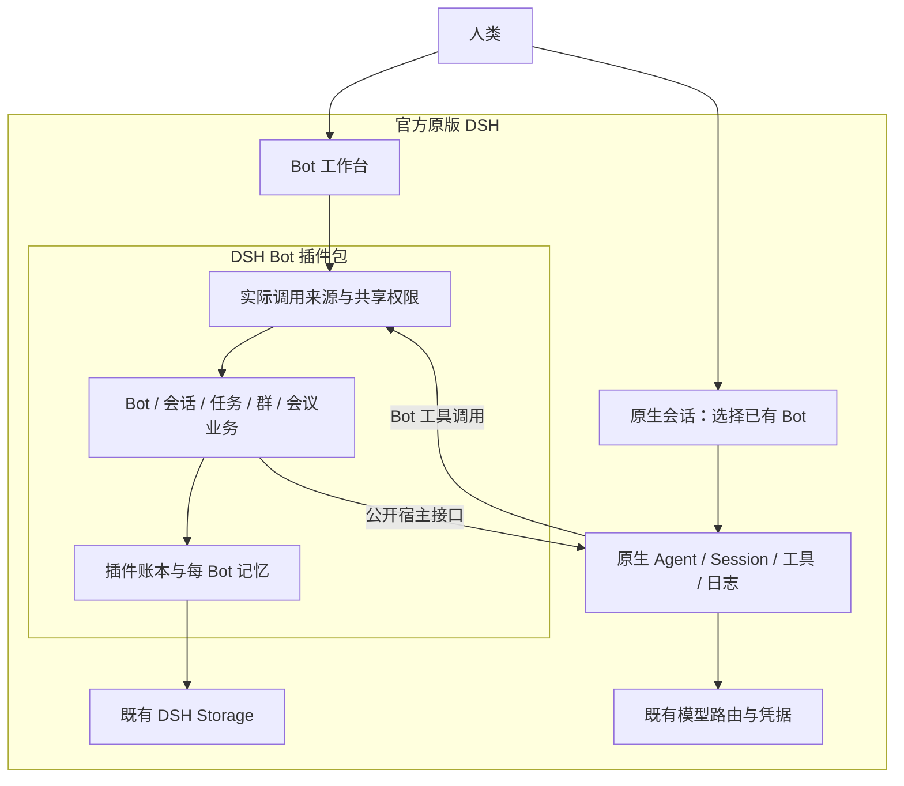

# DSH Bot 原生插件第一版设计

日期：2026-10-08（北京时间）

状态：用户已批准规格，并于 2026-10-08 授权按规格以 goal 模式持续实施，交付前多轮、多角度复审，合格插件上线 GitHub。产品实现与官方 DSH 整体验收尚未完成。

## 1. 要交付的产品

交付一个可安装、启用、配置、禁用和卸载的 **DSH 原生插件包**。用户先拥有正常工作的官方原版 DSH，再通过 DSH 的插件机制安装 dsh-bot，在已有 DSH 内使用全部功能。

DSH 继续负责模型、凭据、Agent、原生 Session、工具、审批、沙箱和原生日志。插件负责 Bot 的长期身份、记忆、会话归属、共享权限、任务责任、群聊与会议编排，以及这些业务状态的持久恢复。

产品直接复用既有 DSH。安装包不包含 DSH/Host/SDK 副本，不要求另建产品专用 Home 或启动另一套应用，不修改 DSH 本体，不以私有 Host 扩展作为运行依赖。隔离的 DSH Home 只用于测试。

首版按原始六项需求完整交付。分阶段实现是工程顺序，各阶段通过不等于正式第一版通过。

### 1.1 已确认的需求

| 需求 | 第一版行为与验收要点 |
| --- | --- |
| 统一管理会话和任务 | 一个管理会话与工作台管理人类授权范围内的普通 DSH 会话、Bot 会话、工作会话及可寻址子任务；呈现真实类型、归属、状态和来源，完整分页包含异常及归档对象。 |
| 可恢复归档 | 停止与归档分开；保存日志与身份，提供恢复入口；首版不物理删除会话或任务。 |
| 多 Bot 长期身份 | 工作台创建、命名和管理多个 Bot；改名不改变身份。每个 Bot 有自己的记忆、会话和任务。 |
| 每 Bot 模型配置 | 从 DSH 已加载的 provider/model/reasoning 中选择，支持联络与执行分别配置、默认相同；不改变 DSH 全局默认模型。 |
| 内部群聊和会议 | 人类与多个 Bot 在 DSH 内部群交流、分工；会议有真实议题、独立意见、讨论、决定及行动项，并产生真实模型请求。 |
| 长任务期间持续联络 | 后台任务未结束时，同一个 Bot 仍能通过独立模型轮回复新话题、查询进展、调整工作和接受停止请求；另一个短任务可在长任务未结束时执行。 |

以上六项来自既有需求与用户本轮对首版范围的确认。[历史 v0.2.1 提取](../../spec-v0.2.1.md)是参考来源，不冒充 Library 后续版本的完整正文；本轮已明确的入口、记忆、授权和官方插件边界优先。

### 1.2 本轮确认的使用规则

1. **两个入口操作同一批对象。** DSH 侧栏的 Bot 工作台创建、命名及管理 Bot；新建 Bot 会话时选择已经创建的 Bot，再开始对话。选择器不在创建会话时偷偷创建另一个 Bot。
2. **一个 Bot 一份长期记忆。** 多个 Bot 分开保存，多个会话不会变成多个同名 Bot。
3. **会话由所属 Bot 管理。** 新会话自动带入该 Bot 的身份、长期记忆和未完成任务；需要细节时，主动查阅自己的其他会话。各会话保留各自的聊天记录。
4. **跨 Bot 默认只读。** 工作台可设置共享范围以及只读或控制权限；授权持续有效、可撤销。
5. **控制面向会话和任务。** 授权范围内可创建会话、发消息、分派或调整任务、停止、归档及恢复；Bot 配置和共享授权由人类设置。其他 Bot 不因此取得修改目标 Bot 记忆的权限。
6. **官方原版 DSH 是宿主。** 全部能力由插件实现，DSH 本体不作修改。

## 2. 方案选择与组成

采用一个插件包，内部使用职责清楚的模块。安装一次即可得到配套的 Host 与 Client 扩展，模块共享同一套 Bot 身份、授权与业务账本。

另一种可行方式是分别安装 Bot、记忆、任务和协作插件；它增加版本配套、配置和生命周期协调，首版不采用。内部模块仍有明确接口，后续可以独立调整实现。

| 模块 | 职责 | 依赖 |
| --- | --- | --- |
| BotDirectory | 创建、命名、配置、暂停及恢复 Bot，管理稳定身份与配置版本。 | PluginStore、DSH 模型目录和 Agent preset 目录。 |
| SessionOwnership | 持久绑定 Bot 与原生会话，区分普通、联络、执行、群参与及会议会话。 | PluginStore、NativeDshAdapter。 |
| BotMemory | 每 Bot 的长期记忆、来源引用、版本和按需查询。 | PluginStore、会话冷读、PermissionPolicy。 |
| PermissionPolicy | 解析实际人类/Agent 调用来源，检查共享范围、操作级别与撤销。 | DSH 的真实上下文、会话归属、持久授权记录。 |
| TaskController | 任务、尝试、容量、调整、停止、产物提交与验收。 | 业务账本、原生 Agent 生命周期及工具执行事件。 |
| ConversationBroker | 联络队列、跨 Bot 消息、工作结果投递与去重。 | 原生消息入口、持久 outbox、原生日志查回。 |
| GroupMeetingController | 群成员、消息、会议阶段、独立意见、讨论及行动项。 | Broker、PermissionPolicy、TaskController。 |
| Reconciler | 查回不明操作、重启恢复、迟到结果归并。 | 原始操作身份、插件账本、DSH 原生日志与实际资源证据。 |
| NativeDshAdapter / Client | 薄封装公开宿主接口；工作台及原生会话入口使用 DSH 插槽、主题、语言和连接。 | 官方原版 DSH 的公开服务。 |

这些是插件的拟议模块，不是声称 DSH 已提供同名接口。所有 UI 和模型工具调用同一组业务方法，避免维护两套操作逻辑。

## 3. 对象与持久状态

Bot 使用稳定 `botId`；名称只是显示字段。会话绑定保存 `botId`、原生 `sessionId`、用途、来源、配置版本和生命周期。任务有稳定 `taskId`、负责 Bot、来源会话、目标、范围及验收条件；重试或续办保留任务身份，另建 `attemptId`。

群使用 `groupId`，会议使用 `meetingId`。同一个群、同一批参与者可以同时拥有不同议题的会议。成员加入、移除及重新加入保存成员世代。操作、消息、投递均有稳定身份和关联链，业务状态使用显式版本和世代检查。

业务状态通过已有 DSH 的 storage KV 后端保存。首版采用独立命名 unit `dsh_bot_v1`、`state/current` 聚合记录：一次业务提交写入一个带 schema/revision 的完整快照，利用公开 KV 单次写入的原子、持久合同。单写入队列串行执行检查、提交和发布；模型、工具与网络工作在提交后执行，不占用写入队列。原生聊天与执行全文仍留在 DSH 日志中，插件保存引用及必要业务内容。

该存储选择避免依赖私有 SDK，也不假定 KV 支持跨记录事务。缺少后端、版本不兼容或数据损坏时，插件报告具体配置/恢复问题，保留已有数据和普通 DSH 功能，不自动换一个空账本重新开始。

一个 profile 内只激活一个业务写入者。多个浏览器页、会话和 Bot 共享此实例，不能各自领取一套容量或生成同一操作的第二份身份。

## 4. 日常使用流程

### 4.1 创建 Bot 与开始会话

工作台创建表单包含名称、角色说明、模型配置，以及 DSH 支持的工作目录、preset 和能力限制。服务器检查实际可用目录及模型；凭据沿用 DSH 管理，不复制到 Bot 配置或记忆。

创建先持久保存操作身份，再保存 Bot。界面分别展示已创建、配置就绪和聊天就绪；只有真实模型轮成功才展示聊天就绪。重复提交查询原始操作，不重复建 Bot。

新建 Bot 会话选择已有 Bot 后，先持久登记会话创建意图与目标原生 Session 身份，再通过公开接口创建/绑定。第一条消息发出前，确认归属、配置、权限和原生持久身份。随后打开 DSH 原生会话界面，标题/信息区显示所选 Bot。

已有普通 DSH 会话继续以原生方式使用。统一管理入口可以按人类授权查看、停止或归档它们；不会因显示在列表里自动变成某个 Bot 的自有会话。Bot 对话选择器只提供已创建的 Bot；普通会话与 Bot 会话在列表中清楚区分。

普通忙会话保留 DSH 的原生 queue/steer 语义；联络与长执行分离的保证针对插件管理的 Bot 执行尝试，不扩写为所有普通会话都能并发新轮。

### 4.2 记忆与历史查阅

Bot 的记忆保存事实、偏好、决定和长期责任，每条记录有归属、版本及来源引用。自动带入的是当前相关记忆与未完成任务摘要，使用有界上下文预算；不会把全部会话全文塞进每次请求。

细节通过工具查询自己的会话和任务，使用原生日志、真实分页及来源引用。冷读不激活 Agent。多个会话同时更新同一 Bot 记忆时，通过版本检查及单写入队列避免覆盖新内容。

跨 Bot 只读不会合并两份记忆，也不会自动把其他 Bot 的全文注入当前会话。Bot 学到共享信息时保留信息来源，不能冒充自己完成了别人的任务或拥有别人的会话。

人类可在工作台查看、修订或让 Bot 忘记长期记忆项；修改记忆不删除原始会话日志。主动遗忘的记录有标记，自动整理不会立刻从相同旧来源重新加入。

### 4.3 共享与控制

默认共享范围为同一 profile 内本插件管理的 Bot 会话、任务状态/结果和记忆记录，级别为只读。Bot 的存储与身份仍然分开；读取共享信息是查询行为，不是共享同一份聊天上下文。普通 DSH 会话需要人类明确纳入 Bot 可访问范围。

工作台可以缩小范围、限制接收 Bot、关闭共享，或对会话/任务授予控制。共享范围是访问上限，控制授权在该上限内生效；控制包含相应读取，但不包含修改 Bot 身份、模型设置、记忆或共享策略。Bot 可以管理自己的记忆；人类可管理全部授权对象。

授权保存授予者、接收 Bot、目标范围、操作级别、版本和是否有效。撤销或缩小范围在持久提交后生效：新调用、排队动作、查回、缓存读取及结果发布都重新核验当前权限。已生效的动作保留真实历史，撤权不伪造回滚或已停止证明。

模型不能在参数里自报可信身份。工具调用从实际 `exec.agent`、真实 Agent context 和持久会话绑定确定 Bot；UI 请求从 DSH 的真实认证连接确定人类。返回的只读数据不带可复用控制对象。

Bot 专属工具对调用来源和资源范围做实际检查，所选原生 preset 的工具继续受 DSH 审批及沙箱约束。不能向 Bot 提供绕过业务权限的账本直写入口；无法限制范围的工具不能用于声称具有该范围隔离的执行。插件业务权限与 DSH 的 OS 沙箱分别验证。

### 4.4 长任务与持续联络

联络和执行使用不同的原生运行通道。对话中的 Bot 可以快速登记任务并分派原生工作 Session，随后继续独立模型轮；后台任务保持未结束时，用户仍可问新话题、查询、调整、停止，或发起另一个短任务。

每个 Bot 的父工作、一级子工作和未结算 UNKNOWN 共用十五个工作槽。子工作深度上限为一级，不递归扩张。短联络与会议参与共用保留的短轮通道，后台执行使用剩余容量；按 Bot 和会话有界轮转，避免一个群或工作挤占全部联络机会。外部 provider 限流和等待如实显示。

每个联络轮冻结有效模型配置，每个执行尝试冻结后续步骤使用的配置；在最终模型调用边界验证同一有效值。修改 Bot 默认仅影响后续新轮或新尝试。原生界面改选或 adapter 默认变化造成冲突时显式报错，不能静默改模型。审批、撤权和资源范围收紧持续有效。

目标、验收条件、模型或负责人调整明确展示待生效点；封住旧尝试准入、结算旧运行后，再按新任务版本建立尝试。旧结果不能通过新验收条件，旧 UNKNOWN 不因调整或人类点击续办而消除。新执行、续办、恢复和交接都使用同一组冲突、权限、容量与配置准入检查。

工作结果先登记提交并保留产物引用，再进行通过、未通过或无法确认的验收。结果投递回任务来源会话，并在工作台可查；关闭来源页面不丢结果。投递使用持久身份查回，不能因超时重复发送。

停止寻址原始任务、尝试、运行世代及其 owned tree。先持久封住后续准入，再向原生运行发送停止；只在模型、工具、子工作等实际资源已结算时释放槽位。停止已接受、停止未结算和结果未知分别呈现，旧停止请求不能影响新尝试。

结算依据是 DSH 实际持有的模型调用、工具执行、owned 子工作和队列的终态，不能只依据 Agent idle。provider 用量和外部副作用的未知状态单独保留；本地运行收敛不冒充外部效果已经完成。

### 4.5 群聊与会议

工作台建立内部群，选择已创建的 Bot 和协调者。人类输入、Bot 输出及任务责任保留真实生产者、群与消息身份。需要回复的 Bot 收到独立参与轮；正常往返允许发生，无限自动回环由轮次、因果链和预算阻止。

会议由人类从群中发起，填写议题、材料、参与者和轮次/预算。参与者先基于同一材料快照产生独立模型意见，原始意见封存；收齐或明确记录缺席后，再进入展示、讨论、决定和行动项阶段。不能把手工填写的意见称为 Bot 已独立思考。

独立意见阶段的临时可见性屏障高于默认跨 Bot 只读及普通控制：其他参与者与主持 Bot 不能通过会话、记忆、查询工具或投递提前读取未公开意见。后续只公开当前会议世代内有效的提交；撤销成员、改议题、迟到结果和同群另一场会议不能混入此轮。

会议生成会话、相关记忆与缓存继承阶段可见性。封存期间，意见仅在该 Bot 本场会议的独立意见通道中可读，不能被同一 Bot 的其他会话预加载或转投；公开及结果投递前再次检查目标与阶段。

会议产出行动项后，经当前有效授权建立有负责人和验收条件的真实任务。结束会议不自动取消这些任务；取消会议和停止任务是不同操作。

群与私聊保留独立聊天记录。记忆仍归 Bot，由来源、共享范围和会议阶段决定在当前语境中能读取哪些内容。对默认可读资源不宣称不可见；人类收紧共享范围后，工具、检索及模型上下文都执行实际限制，不用提示词代替检查。

### 4.6 管理、归档与恢复

管理会话与工作台调用相同业务方法。模型可以在授权范围内查询、定位、调整、停止及归档对象；增加权限、改变共享策略和修改 Bot 配置是人类操作。

归档保留身份和日志，活跃工作不会因隐藏页面而被视为已停止。恢复先检查原生日志与旧操作，再恢复原对象的可见性和可用通道；不创建替代 Bot 来掩盖恢复失败。

重启、连接中断或回执丢失时，保存原始身份并查回。UNKNOWN 不自动重放，也不释放占用。未解执行可以保留只读与正常无冲突联络；是否允许新工作由当前冲突、真实容量和宿主证据决定。

## 5. 官方插件接入与生命周期

包采用官方 `dsh.bundle.patch` 与 Host/Client 导出形式，通过 DSH 插件管理器安装。Client 使用公开 Slots、locale、theme 和 connection；新增工作台与 Bot 选择器，复用原生会话导航、消息展示与审批交互。

插件不替换应用根节点，不覆盖普通 Session 的根数据，不关闭 DSH 自带工作区/会话界面，不安装重复 React，不改全局模型设置。安装所需的插件行和业务配置由标准插件机制管理。

禁用先关闭新准入及界面/工具入口，再收敛插件 owned 运行，排空已接纳的业务写入并卸载注册。只能停止自己持有的运行，不能因插件卸载取消无关普通会话。无法证明结算的资源留为 UNKNOWN。重新启用时恢复原有 Bot、记忆、会话绑定和任务状态。

卸载保留业务数据和原生日志；彻底清除数据不属于首版默认卸载。升级校验存储版本并保留可回退数据；不支持的版本报告原因，不覆写为新空状态。

## 6. 公开接口依据与可行性门

2026-10-08 查询官方 npm，`latest` 为 `@deepseek-ai/dsh@0.2.0-rc.2`，`alpha` 为 `0.2.1-alpha.1`。首个兼容基线使用官方 latest rc.2；不自动替换用户已安装版本。旧候选固定源码为 `1f111d7f3f5c54127a7523571c8ebc1a738575b8`。

已读取独立官方 rc.2 安装中的公开类型、构建文件和自带插件开发说明，并核对 lockfile 中的 registry 来源。这些是静态依据，尚未证明新插件真实可用。

| 已有公开接缝 | 静态依据 | 第一阶段必须证明 |
| --- | --- | --- |
| 插件安装与 Client 插槽 | 官方 cordis-plugin-development 说明、`dsh.bundle.patch`、Slots 与 UiWorkspace。 | 在正常官方 profile 安装后工作台与 Bot 选择器实际显示，普通功能保留；禁用/卸载清理实际注册。 |
| 创建、恢复与 owned 生命周期 | `AgentRegistry.create/resume`、creation setup/commit、`AgentHandle.dispose`、SessionController。 | 首条输入前绑定，持久身份查回，不重复创建，owned 资源真实收敛，不接管无关 Agent。 |
| 模型与最终调用 | Agent-local `installModelSelection`、`agent/request`、prepared immutable LLM call、`llm/stream`、GenerateOptions 的 sessionId。 | 实际调用来源、配置、权限和运行世代绑定；异步改选/撤权不能绕过检查；保留原生模型执行。 |
| 工具与调用来源 | Agent-scoped guard、pre/around/result 执行事件与 `exec.agent`。 | 真实 Bot 身份、只读与控制边界、撤权生效点，以及工具/子工作结算。 |
| 冷读与分页 | sessionQuery 的 observe/read/search/filter，原生 Session 及 Workspace 控制器。 | 可读完整历史、原始身份、归档对象与子任务，不因查询启动全部 Agent。 |
| 业务持久化 | storage KV unit 的单次原子持久写入及显式版本。 | 快照一致、单写入者、重启保留原身份、损坏数据不静默丢弃。 |

第一阶段用最小真实插件验证这些组合，特别是最终 dispatch 来源与冻结、持久操作查回、精确停止及资源结算。测试分别保存成功和失败证据。公开类型存在不等于完成验证；试验插件可加载也不等于首版通过。

接口组合不足时，继续研究官方公开扩展点中的替代实现，并保留明确阻塞。不得补装私有 native-run、修改 Host/SDK、启动独立运行框架或以状态卡片替代真实能力。某项必需能力未通过时，正式 v1 保持未交付状态。

## 7. 现有源码的处理

| 现有模块 | 调整方向 |
| --- | --- |
| `src/plugin.mjs`、`cordis.patch.yml`、包导出 | 从只读入口调整为正式业务插件入口；只依赖官方公开服务，正确管理安装和卸载。 |
| `src/client/client.js` | 保留原生插槽、中文与投影经验；重做工作台、Bot 选择和群/会议交互；删除空 Session 根数据和独立 GUI profile 识别逻辑。 |
| `src/host.mjs`、`src/ledger.mjs` | 复用经检查的身份、版本、幂等、责任及 UNKNOWN 规则；业务操作接入公开宿主来源和上述原生 storage，不沿用私有 runtime-owner 作为生产权限入口。 |
| `src/work-sessions.mjs`、`src/bot-producer.mjs` | 复用任务与结果路由规则，重做公开 DSH 接缝、多个 Bot/会话的绑定及共享容量。 |
| `src/collaboration.mjs` | 复用群成员、会议身份、封存及预算规则；用实际原生模型轮替换手工控制记录，补齐 UI、投递、权限和恢复。 |
| `src/native-controller.mjs`、owner apps、protected provider、profile/distribution installers | 从正式插件运行和分发依赖中移除；历史实验由 Git 历史及明确标记的资料保留，不改名后继续作为安装底座。 |
| 旧测试、验收资料与 Release | 按实际证据分类，复用适用的不变量测试；私有 Host、独立安装和旧 GUI 的通过记录不计入新插件验收。 |

`bot-chain-memory-wait` 是临时等待测试夹具，不是 Bot 长期记忆实现。新增记忆及会话归属必须有自己的持久合同和行为验证。

不把旧私有账本或未验证原生会话自动转换为当前身份；保留原记录和 UNKNOWN。既有原版 DSH 会话由真实宿主接口管理。历史源码及发布资产保留可追溯性，PR #1 保持未合并。

## 8. 实施分解与共同验收

| 阶段 | 可审查的输出 | 阶段完成条件 |
| --- | --- | --- |
| A：官方接入与基础合同 | 正常 DSH 中可安装的最小插件、接口证据、统一身份/存储/权限及生命周期合同。 | 第 6 节能力通过或明确暴露阻塞；普通 DSH 界面和功能保留。 |
| B：Bot、记忆与自有会话 | 工作台、新会话选择、每 Bot 记忆、持久共享与控制。 | 多 Bot、多会话、只读/控制与撤销、冷读和重启一致。 |
| C：任务与持续联络 | 真实原生执行、短轮、子工作、结果/验收、停止/恢复。 | 长工作保持运行时独立答复与短任务成立；容量与精确停止结算成立。 |
| D：群聊、会议与协作 | 群消息、独立意见、讨论、决定及行动任务。 | 三 Bot、两群、同群多会议与真实责任闭环，封存及权限边界成立。 |
| E：安装、回归与发布 | 官方原版 DSH 的完整安装/使用/禁用/卸载验证，实际插件包、中文 GitHub 页面和审计结果。 | 下表全部硬验收通过；产物与源码、测试证据一致。 |

实现计划将按这些相互衔接的工作块列出具体修改、检查和依赖。正式第一版的范围不会因某一阶段完成而缩小。

### 8.1 必须通过的验收场景

| 编号 | 场景 | 通过标准 |
| --- | --- | --- |
| P01 | 在已正常工作的官方 DSH 安装实际打包插件 | 工作台和选择器可见、可操作；既有普通会话、工作区、模型、审批及日志仍可用；Host/SDK 字节未被改写。 |
| P02 | 创建三个有名称、不同配置的 Bot | 身份独立，改名不改 ID；模型来自 DSH 真实目录，每 Bot 设置不影响全局及另一个 Bot。 |
| P03 | 同一 Bot 创建两个会话 | 会话均属于所选已有 Bot；第二个自动带入记忆与未完成任务，并能主动查阅第一个；重提创建不生成替代 Bot/Session。 |
| P04 | 每 Bot 的记忆与历史 | 本 Bot 写自己的记忆，不自动合并他人；并发更新不覆盖新版本，来源可追溯，重启保留。 |
| P05 | 默认跨 Bot 只读 | 可查询默认共享对象；无法发送消息、改任务、停止、归档、写目标记忆或修改其授权。 |
| P06 | 范围内控制与撤销 | 授权后会话/任务操作成立；范围外、降级、撤权和伪造身份均被实际拒绝；缓存、排队及迟到响应不能绕过。 |
| P07 | 一个未结束的长任务与独立联络 | 保持真实后台 barrier，用户新话题产生独立模型答复；ACK、卡片刷新或 steer 不计通过。 |
| P08 | 长任务期间执行另一个短任务 | 短任务真实接纳、执行并返回，长任务此时仍未结束；不以两个顺序任务代替。 |
| P09 | 十五槽与一级子工作 | 父工作、一级子工作和 UNKNOWN 共用上限；超过上限被拒，深度二被拒；联络不被占满。 |
| P10 | 配置冻结与外部改选 | 核对真实最终请求；新默认只影响后续轮/尝试；异步改选、adapter 变化或撤权不能静默绕过。 |
| P11 | 停止与资源结算 | 精确停止目标世代及 owned 子树；区分接纳和实际结算；旧停止不能取消新尝试，未结算保留占用。 |
| P12 | 结果与三态验收 | 真实产物回来源会话，提交与验收分开；通过、未通过、无法确认均可表达，重复投递查回不重发。 |
| P13 | 两个内部群与多 Bot 分工 | 各成员产生真实模型轮与真实工作；参与者、消息来源及群归属正确，正常往返可行而自动回环有界。 |
| P14 | 同群同时两场不同议题会议 | 材料、独立意见、阶段与预算分开；封存期间无法通过跨会话/记忆读取他人意见；讨论后有决定与可执行行动项。 |
| P15 | 改成员/议题、撤权与迟到意见 | 旧世代提交不混入新会议；缺席有真实原因，不能伪造全员完成。 |
| P16 | 管理普通、Bot、归档及异常会话 | 按授权范围完整定位，重名最小消歧，真实分页不冒充全集；冷读不唤醒全部 Agent。 |
| P17 | 归档与恢复 | 停止和隐藏分开，日志保留；同一 Bot/任务/会话身份恢复；坏日志与 UNKNOWN 不被替代创建掩盖。 |
| P18 | 丢回执、断线、宿主重启 | 原始身份可查回，UNKNOWN 保持，不重放历史请求/副作用，不重复领取容量或建立对象。 |
| P19 | 多页并发及插件生命周期 | 同一身份和授权正确复用；禁用、重新启用、卸载、升级不留下失控注册，不取消无关会话，不丢日志/记忆。 |
| P20 | Linux 与 macOS 原生安装及 GUI | 两平台分别运行实际官方 DSH 与实际插件包的完整使用流程；记录准确版本、源码提交、包哈希和可复现步骤。 |
| P21 | 最终分发与中文 GitHub 页面 | 标准插件安装说明可实际执行；依赖只有公开必要引用；最终包、refs、资产和历史审计符合发布条件，未公开的内容不误称已公开。 |

故障与资源边界测试先使用合成材料和可控 provider；涉及 Bot 理解、独立联络、群意见和会议决定的场景再用真实已配置模型。记录实际请求和 usage，UNKNOWN 用量保留，不重放旧 UNKNOWN 来凑证据。测试报告区分静态、离线、合成 provider、真实宿主与真实模型结论。

## 9. GitHub 交付与旧候选

中文首页、安装页和 Releases 都围绕官方 DSH 插件撰写。完成前清楚展示设计/实现/验收状态；最终资产为插件包及校验、说明和对应证据，不把旧 Host 分发包继续列作推荐安装。

旧独立软件路线完全作废。历史 `v0.1.0-private.1` 保留资产与原始限定证据以便追溯，明确标为“作废：独立软件版”，不提供安装推荐、不代表本设计的第一版交付。当前生产包、导出、启动、安装和分发入口移除旧 Host／owner 路线；历史实验只在 Git 历史和明确作废的资料中查阅。仓库保持当前访问范围，PR #1 不合并。

## 10. 本文审阅后的下一步

确认本文准确表达需求后，按 Superpowers writing-plans 编写具体实施计划，再依照所选执行方式调整代码。计划和实现遵守同一个官方原版 DSH 边界；所有阶段的结果最终回到 P01–P21 验收，不以历史证据或单一 CI 通过替代整体验收。
